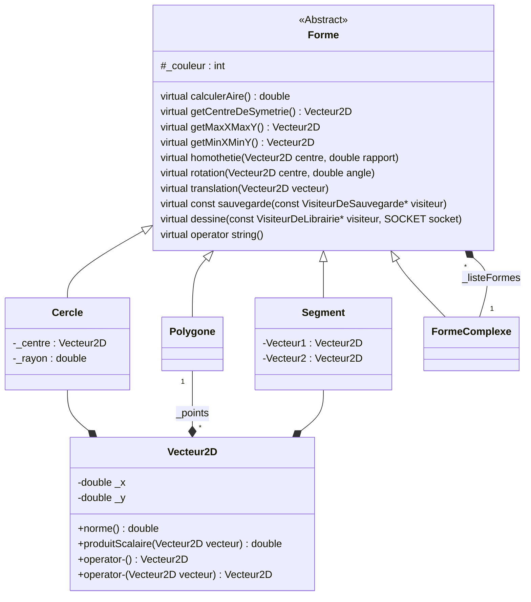
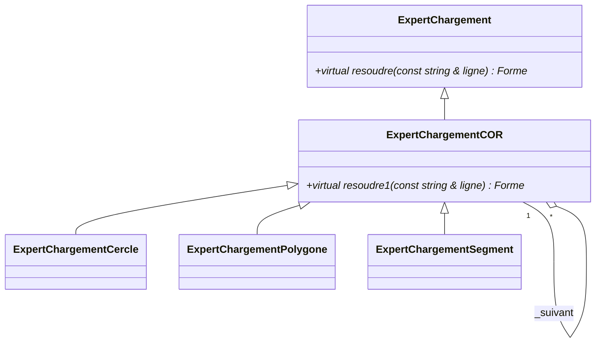
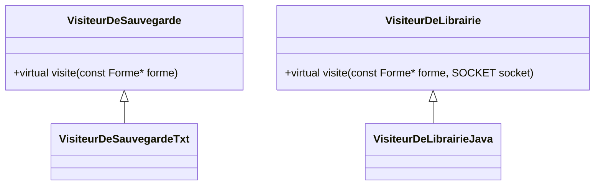

# Les UML

## Diagramme de classes de la partie client

### Les formes


### Les Experts


### Les Visiteurs


### Autres classes
```mermaid

    class Erreur{
        +operator string()
        +testeEgalite (int m, int n, const char *message)
        +testePlusPetitOuEgal (const int a, const int b, const char *message)
        +testeAppartient (int a, int x, int b, const char *message)
        +testeNonVide (const void *d, const char *message)
    }

    class ChargeurListeForme{
        +charge(ifstream & fichier) vector<Forme*>
    }

    InitCommunication "1" o-- "1" InitCommunication

    class InitCommunication{

        +getInstance() InitCommunication*

        +demarrerConnection (int port, const char * adresse)
        +getConnecter() bool
        +getSocket() SOCKET
        +getR() int
    }
```
